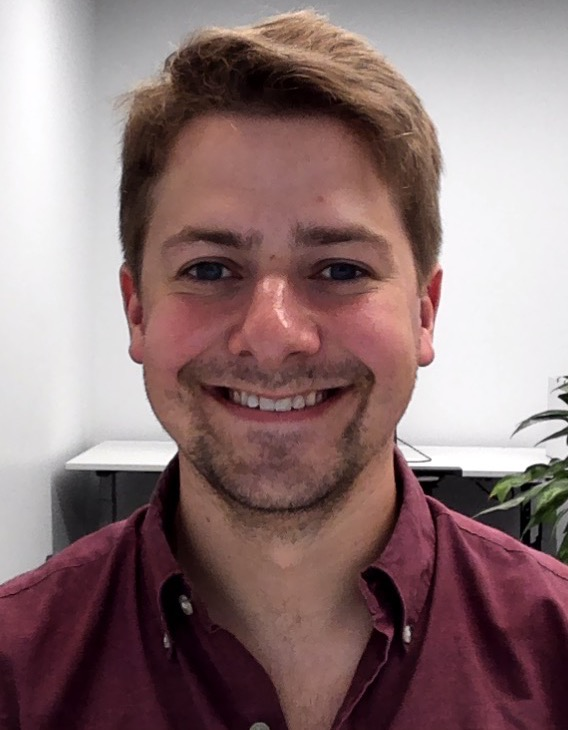

I'm a Research Fellow at the Flatiron Institute's Center for Computational Astrophysics in New York City.

I work broadly within the realm of **gravitational-wave astronomy**.
Nearly infinitesimal ripples in the fabric of spacetime, gravitational waves are generated by the most cataclysmic events in the Universe, including the explosions of stars and the relativistic collisions of black holes.
My interests lie in the continued search for gravitational waves, the development of new and more powerful detection methods, and the use of gravitational waves as tools with which to answer novel astrophysical questions.

Before arriving at the Flatiron, I attended Carleton College in Northfield, MN.
I then spent one year at the University of Cambridge, funded by a Churchill Scholarship, before moving to Caltech to complete my Ph.D. in Physics in the LIGO Laboratory group.

